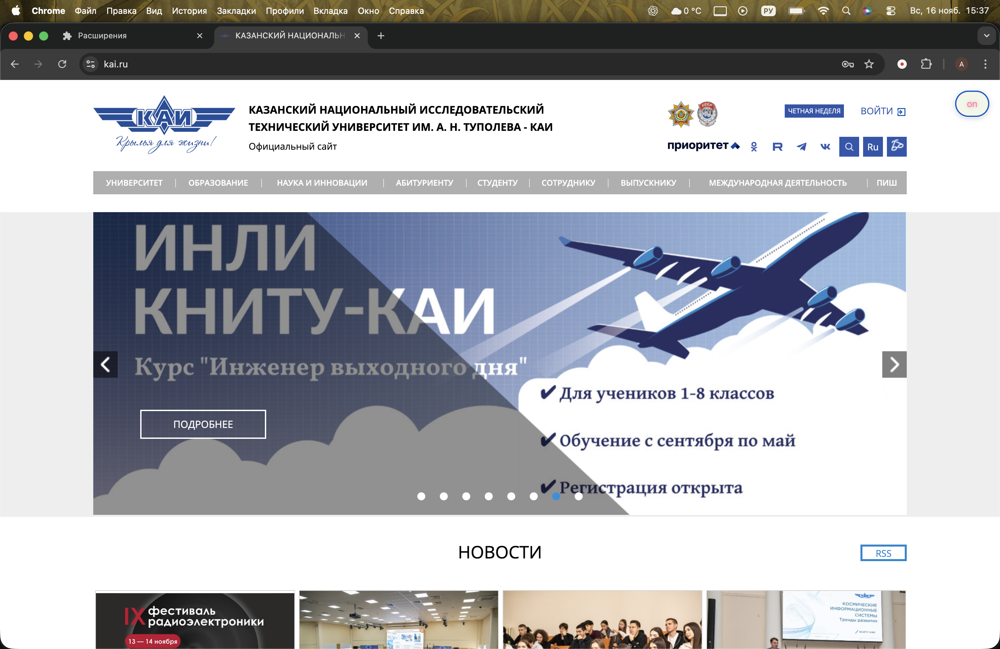
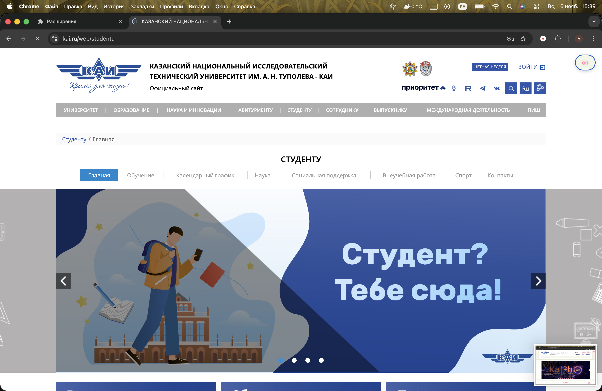
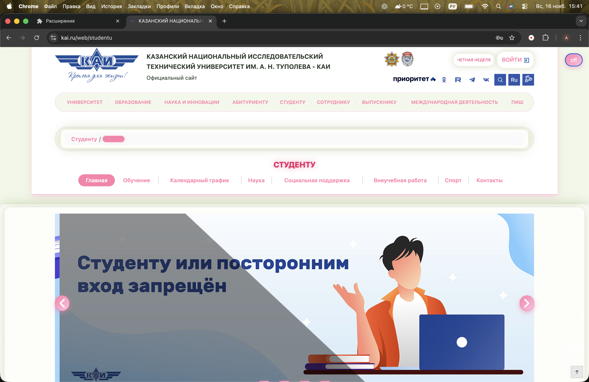

# KAI Spring Theme

## Описание

Расширение для браузера (Chrome / Yandex Browser), которое добавляет на сайт kai.ru весеннюю тему:

- общий фон — светло-зеленый `#f1f7e9`
- ссылки — розовый `#ff80ab` (цветочные акценты)
- мягкие тени и закругленные блоки, создающие ощущение «весеннего» интерфейса

Основные изменения:

- **Фон страницы и основных блоков** — светло-зеленые и почти белые оттенки
- **Ссылки** — розовый цвет с подсветкой при наведении
- **Кнопки и стрелки** — градиент от розового к нежно-розовому, круглые, с тенью
- **Шапка и навигация** — белый фон с розовыми разделителями и плавными тенями
- **Футер** — светло-розовый фон с «цветочными» акцентами на ссылках
- **Заголовки** — более яркий розовый с подсветкой, легкий «праздничный» эффект

Тема применяется как минимум на главной странице и на других разделах сайта `kai.ru`.

---

## Функциональность

- **Кнопка-переключатель темы**  
  Появляется на сайте `kai.ru`:
  - фиксируется в правом верхнем углу страницы

- **Статус темы прямо на кнопке**
  - когда тема **выключена** — текст: `on`
  - когда тема **включена** — текст: `off`

- **Сохранение настроек**
  - состояние темы сохраняется в `localStorage`
  - при перезагрузке сайта тема автоматически включается/выключается согласно последнему выбору

- **Работа на нескольких страницах**
  - стили применяются на главной и всех страницах внутри `https://kai.ru/*`

---

## Инструкция по запуску

1. Открыть в браузере страницу управления расширениями:
   - Chrome: `chrome://extensions/`
   - Yandex Browser: `browser://extensions/` или меню → Дополнения

2. Включить режим **«Режим разработчика»** (Developer mode).

3. Нажать **«Загрузить распакованное расширение»**.

4. Выбрать папку с файлами расширения.

5. Открыть сайт `https://kai.ru`.

6. Нажать кнопку `on` — сайт переключится в весеннюю тему.  
   Повторное нажатие (`off`) вернёт стандартный вид.

---

## Примеры (папка `images/`)

  
  

  
  